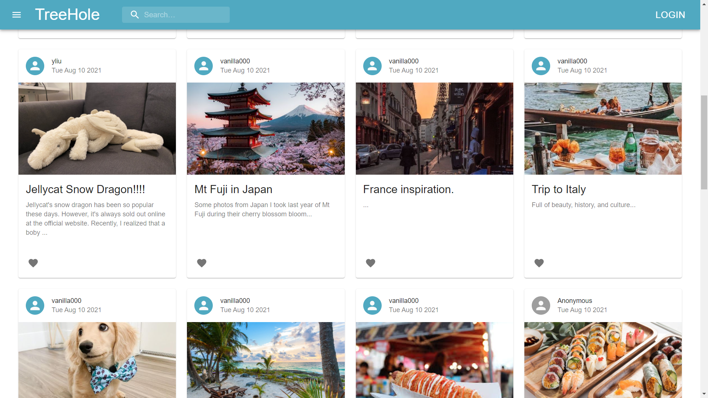
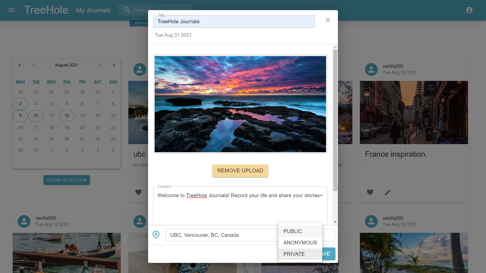
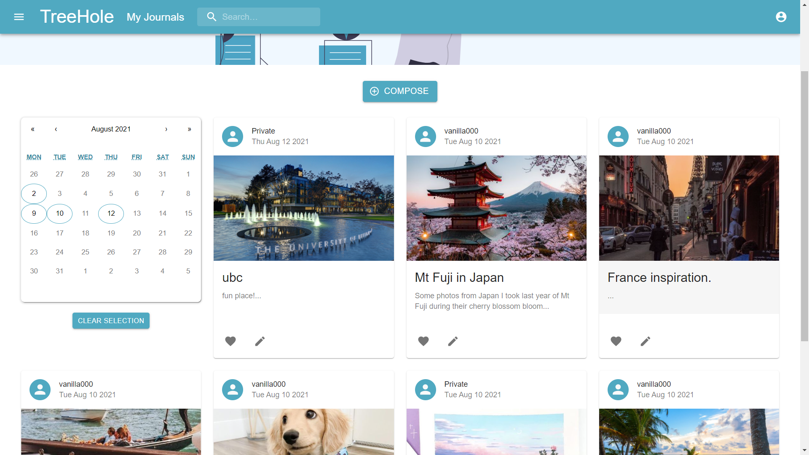

# TreeHole

TreeHole creates a place where people can record their life and share their stories. Journals can contain texts, pictures, dates, and locations. Their visibility can be set to private, anonymous, or public. Users can also explore, comment, and like the public and anonymous journals composed by the others. <br> <br>
The website is up and running, you can find it here: <br>
https://treehole-journals.herokuapp.com/

## Table of Contents
- **[Introduction](#treehole)**
- **[Features](#features)**
- **[Get Started](#get-started)**
  - **[Use the Already Deployed Web App](#use-the-already-deployed-web-app)**
  - **[Play With the Code](#play-with-the-code)**
- **[Project Structure](#project-structure)**
- **[Technology Usage](#technology-usage)**
- **[Challenges](#challenges)**
- **[Next Steps](#next-steps)**
- **[Authors and Contributions](#authors-and-contributions)**

## Features
&nbsp;&nbsp;&nbsp;&nbsp;  ✅  Explore others' stories



&nbsp;&nbsp;&nbsp;&nbsp;  ✅  Search contents or sort them by newest, hottest, or nearest


&nbsp;&nbsp;&nbsp;&nbsp;  ✅  Read them in detail and make comments


&nbsp;&nbsp;&nbsp;&nbsp;  ✅   Compose your own journals



&nbsp;&nbsp;&nbsp;&nbsp;  ✅   Manage your stories and likes



## Get Started

### Use the already Deployed Web App
Open the website in a browser:
```sh
https://treehole-journals.herokuapp.com/
```
You can sign-up or login by clicking the LOGIN icon on the top right. <br> <br>
You can switch pages by clicking the expandable navigator on the top left.

### Play With the Code
`under construction`

## Project Structure
```bash
TreeHoleJournal
├── DemoImages
│   ├── Comments.png
│   ├── Compose.png
│   ├── Explore.png
│   ├── Me.png
│   └── Search.png
├── Procfile
├── README.md
├── backend
│   ├── Server.js
│   ├── controller
│   │   ├── JournalControllers.js
│   │   └── UserControllers.js
│   └── models
│       ├── JournalSchema.js
│       └── UserSchema.js
├── frontend
│   ├── package-lock.json
│   ├── package.json
│   ├── public
│   │   ├── favicon.ico
│   │   ├── index.html
│   │   ├── logo.png
│   │   ├── logo192.png
│   │   ├── logo512.png
│   │   ├── manifest.json
│   │   ├── robots.txt
│   │   └── treeicon.png
│   └── src
│       ├── App.js
│       ├── App.test.js
│       ├── GlobalCss.js
│       ├── assets
│       │   ├── collection_bg.svg
│       │   ├── explore_bg.svg
│       │   ├── login_background.png
│       │   ├── login_image.png
│       │   ├── myjournals_bg.svg
│       │   ├── photo_placeholder.svg
│       │   ├── saved_page_bg.svg
│       │   └── sign_up_image.png
│       ├── authAPI
│       │   └── auth-context.js
│       ├── components
│       │   ├── AccountInfo.js
│       │   ├── CardHolder.js
│       │   ├── Coda.js
│       │   ├── Comment.js
│       │   ├── CommentArea.js
│       │   ├── CustomizedComponents.js
│       │   ├── EntryCards.js
│       │   ├── ExploreTabs.js
│       │   ├── Header.js
│       │   ├── JournalCalendar.js
│       │   ├── JournalEditingModal.js
│       │   ├── JournalLocation.js
│       │   ├── JournalModal.js
│       │   ├── JournalViewingModal.js
│       │   ├── LeftNavBarDrawer.js
│       │   ├── LoadingSpinner.js
│       │   ├── LocationError.js
│       │   └── SearchTag.js
│       ├── customHooks
│       │   └── useMountedState.js
│       ├── customizedTheme.js
│       ├── index.css
│       ├── index.js
│       ├── reportWebVitals.js
│       ├── screens
│       │   ├── Explore.js
│       │   ├── Liked.js
│       │   ├── Login.js
│       │   ├── Me.js
│       │   └── SignUp.js
│       ├── services
│       │   ├── JournalServices.js
│       │   └── UserServices.js
│       ├── setupTests.js
│       └── stylesheets
│           ├── App.css
│           ├── JournalCalendar.css
│           ├── LoginStyle.js
│           ├── SignUpStyle.js
│           └── modal.css
├── nodemon.json
├── package-lock.json
└── package.json
```

## Technology Usage

#### JavaScript, HTML, CSS

CSS, JavaScript, and HTML are all being utilized in various areas of this projects, with `index.html` as the entry point of this project, `CSS` for the styling of components, and `JavaScript` to form the individual components in React as well as composing the backend of this project. 

#### React

`React` forms the backbone of the projects. We have used multiple React technologies to enhance our functionalities. `useState` to maintain data consistency between editing modal, journal entry and screens containing these entries. `createContext` to provide multiple components with authentication info, enabling conditional rendering and token to access information in database. 

#### Node.js and Express

We implemented our backend with `Node.js`. We also used `Express.js` as our RESTful framework. The backend provides several endpoints for CRUD operations on journals, comments, as well as users, which the front end can access through `axios`.

#### MongoDB

We stored all our user generated data and user information as documents in the document-based databased `MongoDB`. Compared to traditional relational databases, MongoDB is more flexible accessing it is easier comapred with SQL queries. We also used `Mongoose` to connect our `Node.js` backend with the database.

#### Release Engineering

In order to ensure users can access their information everywhere, we have hosted our website in Heroku. In Heroku, we have made use of the `Secrets` function to hide API access tokens and keys from the codebase. We have also delegated the burden to continuous deployment to **GitHub Actions,** so that changes made to the `master` branch will be applied to the website within minutes.


## Challenges

### Infinite Scrolling

A challenge that we have met during our process to design the explore page was its scalability. When there are thousands of journals in the page, performing lazy loading to download all the journals at once would likely result in a serious lag in time. Therefore, we turned our attention to infinite scrolling which loads only a batch of journals every time the user scrolls to the bottom of the page.

Because MongoDB does not have built-in pagination functionality, we have to implement the feature by ourselves. A straightforward solution to this is to keep the number of loaded items, and let the database skip the items every time it is queried. However, this design is still susceptible to scalability issue because the database still needs to traverse through all the loaded items.

Therefore, we decide to use flag points to reference where the database should start to load. Since the journals are sorted by the date they are composed, we use a flag point that comprises the Date (or popularity for hottest, location for nearest) and journalID. When we query the database, we use this flag point to locate the last loaded journal and load the ones after this point. As Date and JournalID are indexed in the database, this solution works really well, achieving comparable speed as compared with other social media platforms.

### Auto Logout 
	
If the user has been idle for two hours or left the website for more than one hour over the token expiration time, the user will be automatically logged out. One of the challenge we had was to calculate the time difference between now and the token expiration time. 

## Next Steps

- **Move requests information to headers**  
Currently all requests are being sent over the url. We plan to move these requests in the header since we can have more request data stored in a header as we plan for more complex queries.
- **Ability to follow others, view all posts from another user**   
Similar to other social media apps, a user may want to explore all the posts created by someone that they follow. In the future we may include a personal page that can be customized by the user, and includes all of the user's public posts.
- **Email confirmation**  
We want to have a way to confirm that a user has a working email, so that we can send notifications when their posts is being commented and liked. A valid email address also allows to add other verification features, like reset password.

## Authors and Contributions

### Emily Lian

Emily was the owner of the viewing and editing modal of journals. She implemented most of the functionalities in the modals such as creating and editing title, content and location of each post. She was also the UI designer for this project.

### Frank Zhou

Frank designed and implemented the cards component and screen layout, configured Amazon S3, connected S3 to TreeHole to enable picture upload, and created the account info page. He was in charge of setting up JIRA, GitHub, as well as setting up relevant documentations, including this document.

### Yuchen Liu

For backend, Yuchen spent most of his effort on developing authentication using Firebase while also contributing to the backend to enable multiple database actions such as creating/ updating/ validating users' profile in database, letting users like/unlike journals, querying various user information via secured methods. Yuchen designed the navigation bar used in all screens, optimized card component fetching logic, prevented useEffect call memory leak, and established journal like button logic.

### Yuhua (Maxwell) Wang

Max was in charge of setting up the MongoDB database and developing the C.R.U.D. (Create, Read, Update, Delete) functionalities for handling journals and comments. He implemented the search and sorting mechanism for explore page. He is also the person behind the infinite scrolling feature.

